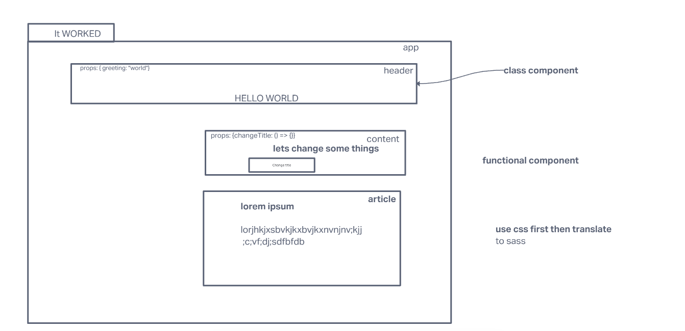

# 27 - Class 401d49

## Project: RESTy

### Author: Hunter Fehr

### Problem Domain  

using the useState() hook in our functional components. In order to properly manage state with the useState hook, we will now convert App.js to a functional component.

### Links and Resources

- [git hub](https://github.com/hmfehr/resty)
- [Sandbox Monday](https://codesandbox.io/p/github/hmfehr/resty/draft/naughty-pond?file=%2FREADME.md)
- [Sandbox Tuesday]()

#### How to initialize/run your application (where applicable)

- e.g. `npm start`

#### Features / Routes

- Feature One: base layer of react application
- feature two make app a function and also wrote one testing pass
- Another Feature is getting the get post put and delete options to stay selected

#### Tests

- test done for header i need help with the form 

#### UML

